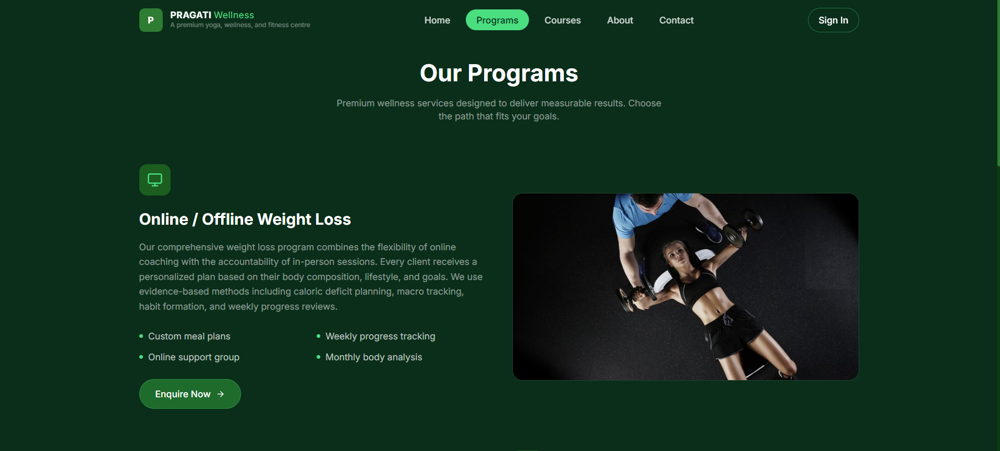
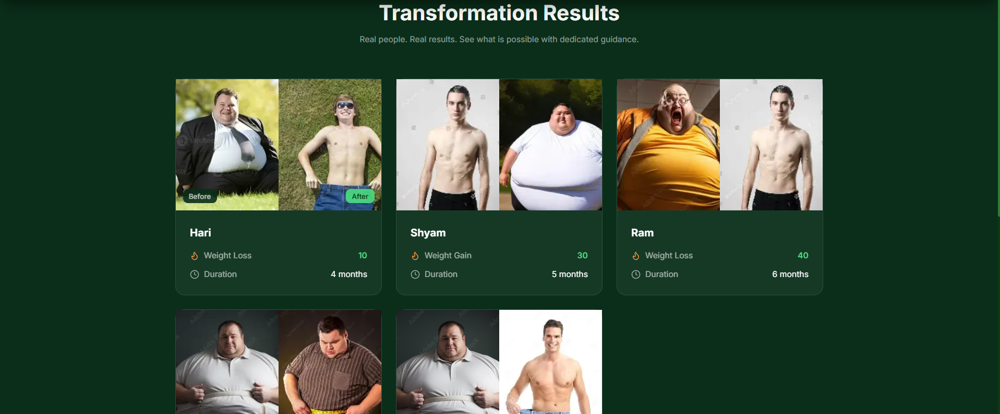
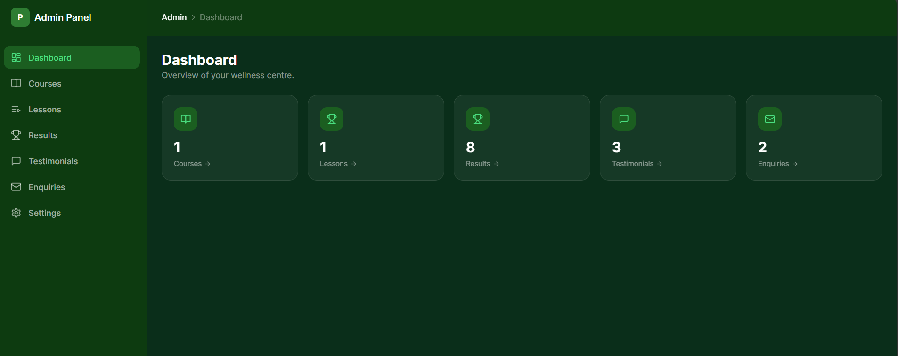
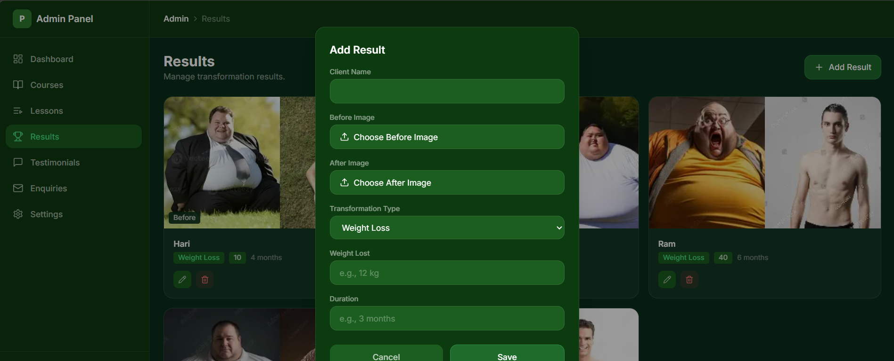
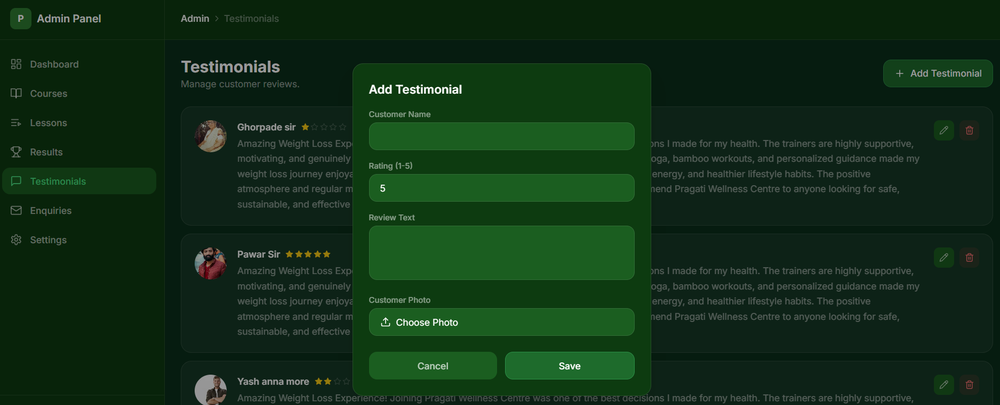
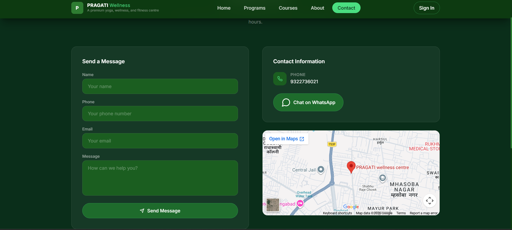
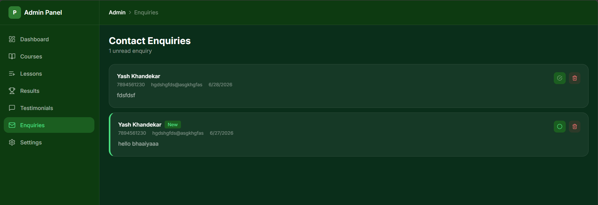

# 🏋️ Pragati Wellness Centre

A modern Fitness & Wellness website built using **React**, **TypeScript**, **Tailwind CSS**, and **Supabase**.

## ✨ Features

- 👨‍💼 Admin Dashboard
- 📚 Course Management
- 🎥 Video Lessons
- 🏆 Before / After Transformation Results
- 💬 Customer Testimonials
- 📩 Contact Enquiries
- ⚙️ Website Settings Panel
- 📱 Fully Responsive Design
- ☁️ Supabase Storage for Image Uploads
- 🔐 Secure Authentication

---

# 📸 Screenshots

## Home


## Courses



## Results



## Admin Dashboard



## Admin Results



## Testimonials



## Contact



## Enquiries



---

# 🛠 Tech Stack

- React
- TypeScript
- Tailwind CSS
- Vite
- Supabase
- PostgreSQL
- HTML5
- CSS3

---

# 🚀 Installation

```bash
git clone https://github.com/neels2003/pragati-wellness-centre.git
```

```bash
cd pragati-wellness-centre
```

```bash
npm install
```

```bash
npm run dev
```

---

# 📂 Folder Structure

```
src/
components/
pages/
hooks/
lib/
types/
supabase/
Screenshots/
```

---

# 📌 Future Improvements

- Payment Gateway
- User Authentication
- Course Progress Tracking
- Attendance System
- Notifications
- Dark / Light Theme

---

# 👨‍💻 Developer

**Neelesh Deshpande**

GitHub:
https://github.com/neels2003